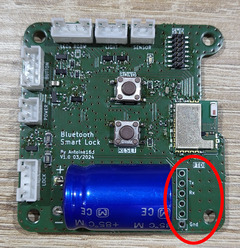
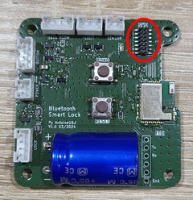

# Firmware de Serrure Bluetooth LE

Ce guide fournit les instructions pour compiler, flasher et programmer le firmware de la serrure Bluetooth LE basée sur le module BlueNRG.

---

## 🚀 Compilation

### Étapes à suivre :

1. Cloner le projet et ses sous-modules :
   ```bash
   git clone --recurse-submodules https://github.com/antoine163/ble-smart-lock-firmware.git
   ```

2. Installer la chaîne de compilation croisée `arm-none-eabi-gcc`.

3. Installer l'outil `cmake`.

4. Télécharger le SDK [STSW-BLUENRG1-DK](https://www.st.com/en/embedded-software/stsw-bluenrg1-dk.html). 
   > *Remarque : L'inscription sur le site de STMicroelectronics est nécessaire.*

5. Extraire le SDK avec `innoextract` :
   ```bash
   mkdir src/device/bluenrg-2
   innoextract BlueNRG-1_2\ DK-3.2.3.0-Setup.exe -I app/Library
   mv app/Library/* src/device/bluenrg-2/
   rm -r app
   ```

6. Configurer la chaîne d'outils :
   Si le compilateur croisé n'est pas détecté, spécifiez son répertoire avec la variable d'environnement `ARMGCC_DIR`.

7. Compiler le projet en fonction du modèle BlueNRG (M2SA ou M2SP) :
   ```bash
   export ARMGCC_DIR="/chemin/vers/arm-gcc"
   mkdir build && cd build
   cmake --toolchain cmake/arm-none-eabi-gcc.cmake -DMODEL_BLUENRG=M2SA -DCMAKE_BUILD_TYPE=Release ..
   make
   ```

---

## 🔌 Flashage du Firmware

### Via UART

1. Connecter un module FTDI (3.3V) au connecteur FTDI sur le PCB.  
   Vous pouvez également utiliser le connecteur STDC14 (repéré SWD sur le PCB).

2. Télécharger [RF-Flasher Utility](https://www.st.com/en/embedded-software/stsw-bnrgflasher.html).  
   > *Inscription requise sur le site de STMicroelectronics.*

3. Passer le module en mode bootloader :  
   Maintenez le bouton `bond` enfoncé, puis appuyez sur `reset`. Relâchez ensuite `bond`.

4. Utiliser RF-Flasher Utility :
   - Sélectionnez le port COM.
   - Choisissez le fichier `ble_smart_lock.hex` dans le dossier de build ou `release`.
   - Cliquez sur `Flash` pour lancer le processus.

5. **Redémarrer le module** en appuyant sur le bouton `reset`.

---

### Via SWD

#### Avec *OpenOCD*

1. Installer **OpenOCD** sur votre système.

2. Après la compilation :
   - Naviguez dans le dossier de build.
   - Lancez la commande :
     ```bash
     make flash
     ```

3. Messages attendus à l'écran :
   ```text
   ** Programming Started **
   ** Programming Finished **
   ** Verify Started **
   ** Verified OK **
   ** Resetting Target **
   ```

   > *Remarque :* Si le module ne répond pas, il pourrait être en veille. Faites un reset en appuyant sur le bouton `reset` avant de réessayer.

#### Avec *BlueNRG-1 ST-LINK Utility*

1. Télécharger [STSW-BNRG1STLINK](https://www.st.com/en/embedded-software/stsw-bnrg1stlink.html).

2. Installer et lancer **ST-LINK Utility**.

3. Procéder au flashage :
   - Faites glisser le fichier `ble_smart_lock.hex` dans l'interface principale.
   - Cliquez sur le bouton `Program verify` pour démarrer la programmation.

---

## 📸 Images de référence

| FTDI/UART | SWD/UART |
|-----------|----------|
|  |  |

